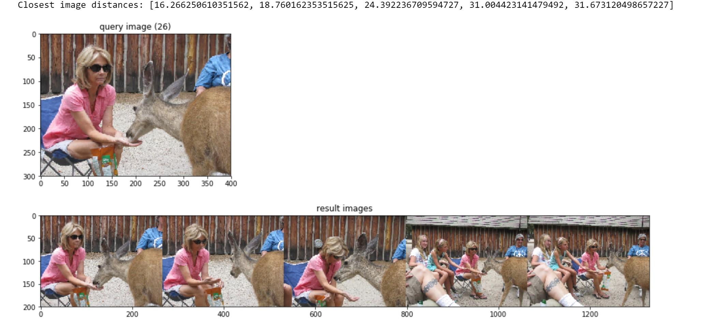

# Image Similarity

## Reverse image search and retrieval with Keras

Inspired by :https://github.com/ml4a/ml4a-guides/blob/master/notebooks/image-search.ipynb

This script uses previously-trained neural network ResNet50 from Keras to search through a large collection of images. Specifically, it will show you how you can retrieve a set of images which are similar to a query image, returning you its n nearest neighbors in terms of image content.

It removes the last classification layer from the network, leaving the last fully-connected layer as the new output layer. The way we do this is by instantiating a new model called feature_extractor which takes a reference to the desired input and output layers in our ResNet50 model. Thus, feature_extractor's output is the layer just before the classification, the last 2048-neuron fully connected layer.

With ResNet50 model, a distance of 20.0 seems to be a good threshold to filter similar images.

## Requirements:
```
numpy==1.13.3
Keras==2.1.2
scipy==1.0.0
scikit_learn==0.19.1
```

## Input
It reads the paths for the images from the input file : ```input.txt```

## To run:
```python similarity_resnet50.py```

jupyter notebook: ```keras_resnet50.ipynb```

## Similar Images:

 


